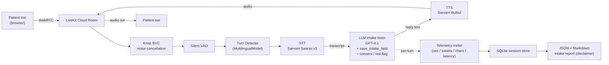
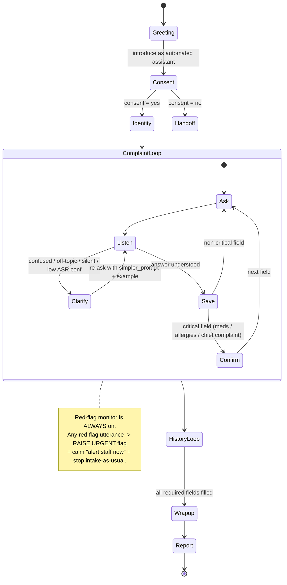

# Architecture

Cascaded pipeline (STT → LLM → TTS), **not** speech-to-speech — chosen so every provider is
swappable, separately cost-metered, and debuggable (CLAUDE.md §3). POC runs one pipeline
(`indic_quality`) on LiveKit Cloud.

## Pipeline (POC)

Notes:
- **Krisp BVC** requires LiveKit Cloud (verified 2026-06-14). Applied once on the input track
  via `RoomInputOptions(noise_cancellation=...)`; client-side noise filter is disabled.
- **Languages: en + hi + mr.** The semantic `MultilingualModel` turn detector covers en/hi but
  **not Marathi** (verified against the installed model). So Marathi sessions fall back to
  **VAD endpointing** (`turn_detection="vad"`); STT/TTS handle Marathi natively (Sarvam `mr-IN`).
  Turn handling is configured via `TurnHandlingOptions(endpointing=EndpointingOptions(...))`.
- The meter records counts/cost/latency only — **never clinical content** (§9).

## Conversation state machine (intake brain)

The red-flag monitor and the consent gate are enforced as explicit code paths
(`intake/red_flags.py`, the consent check in `agent/intake_agent.py`), not just prompt text.
